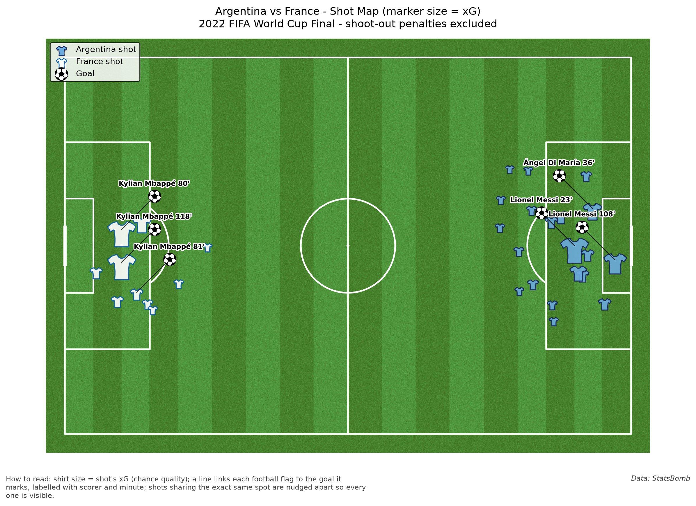
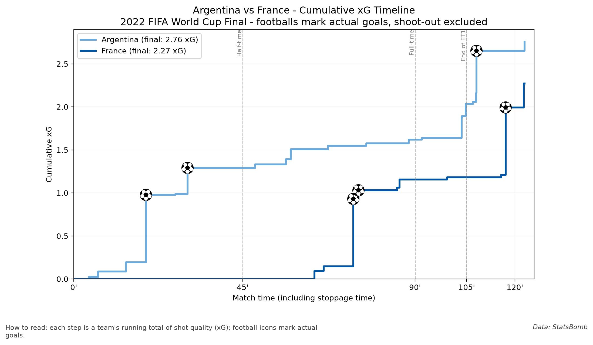
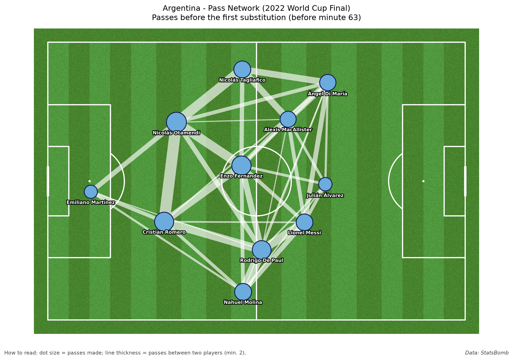

# 2022 World Cup Final — Argentina vs France

A short football data analysis of the 2022 FIFA World Cup Final (Argentina vs
France), built with [statsbombpy](https://github.com/statsbomb/statsbombpy)
and [mplsoccer](https://mplsoccer.readthedocs.io/) on top of StatsBomb's free
open data. The script pulls the match's raw event data, prints a shot-by-shot
summary to the console, and produces three charts.

## Charts


Every shot in the match, sized by xG, with each goal flagged and labelled with the scorer and minute.


Each team's running total of shot quality (xG) through 90 minutes plus extra time.


Argentina's starting XI: average position per player and how often each pair passed to one another, up to the first substitution.

## Key findings

Argentina dominated the first 67 minutes. They took nine shots worth 1.51 xG and led 2–0, while France didn't manage a single shot until the 68th minute.

## Tools

- [statsbombpy](https://github.com/statsbomb/statsbombpy) - pulls the match events and lineups from StatsBomb's open data
- [mplsoccer](https://mplsoccer.readthedocs.io/) - draws the pitches, the pass network, and the football markers
- [pandas](https://pandas.pydata.org/) / [numpy](https://numpy.org/) - shaping and aggregating the event data
- [matplotlib](https://matplotlib.org/) - the underlying charting library

## How to run

```
pip install -r requirements.txt
python worldcup_final_analysis.py
```

This downloads the match data fresh each time, prints the shot table and xG
totals to the console, and (re)writes `shot_map.png`, `xg_timeline.png`, and
`pass_network_argentina.png` in this folder.

Data: StatsBomb
